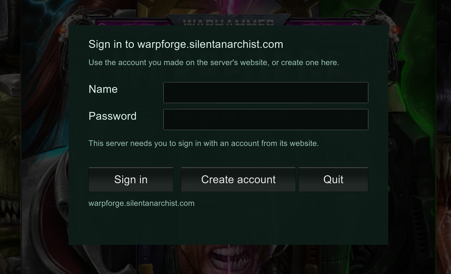

# Warpforge Revival mod

A [MelonLoader](https://melonwiki.xyz/) mod that lets *Warhammer 40,000: Warpforge* run against a
community-hosted server now that the game's own servers are closed.

This repository is the complete source of `WarpforgeRevival.dll`, the Windows build. The same
source also builds the Android mod (the parts marked `ANDROID_PORT`); the Android project, the
patcher that puts the mod loader into the Android game, and the instructions for phones are in
[warpforge-revival-mod-android](https://github.com/silentanarchist/warpforge-revival-mod-android).
Versions are numbered `x.y.z.f-w` for Windows and `x.y.z.f-a` for Android: `x.y.z` is the shared code
and always the same on both; `f` counts fixes made for one of them only, is left off while it is 0
(`0.12.1-w`), and starts again with every new `x.y.z`. The server it talks to is in
[warpforge-revival-server](https://github.com/silentanarchist/warpforge-revival-server).

This is an unofficial fan project. It is not affiliated with or endorsed by Everguild or
Games Workshop. It contains no game files: you need your own copy of the game.

**About AI use.** The code and documentation in this repository were written largely by an AI
assistant (Anthropic's Claude), working under the maintainer's direction; the maintainer decided
what to build and tested it in the game. Testing is by hand and limited to what the maintainer
has played, so expect bugs. Read the code before you rely on it, and please report what you find.

## What it does

- **Sends the game's server requests to a revival server** instead of the closed ones (`PlayFabTransport.cs`).
- **Matches** run on the revival server's own match service. The game never contacts Photon's
  servers (`PhotonService.cs`, `Matchmaking.cs`). The mod proves to the match service who is
  connecting with a match ticket from the game server (`MatchTicket.cs`), and carries match
  connections inside https when the server offers it (`MatchTunnel.cs`).
- **Global chat** runs through the revival server (`GlobalChat.cs`). **Report message** on a player
  goes to the server, where its admins see it; **Block player** is the game's own and hides that
  player's messages for you only.
- **AI opponent emotes** now and then instead of after every move (`BotEmotes.cs`).
- **Custom Test**, a 60-card mode added by the revival (`LongGame.cs`).
- **Profile additions:** win/loss record and skulls, friend codes, free renames (`ProfileStats.cs`, `ProfilePage.cs`).
- **Accounts:** when a server requires one, a sign-in window appears while the game loads (or a
  game login file from the server's website is used); otherwise linking a site account is
  optional (`GameSignIn.cs`, `AccountPage.cs`). With an account, **Sign out** in Settings >
  Account signs out this computer only; the account keeps its game progress.
- **Encrypted connection:** a server address without `http://` is tried over https first, and a
  server that has answered over https is never contacted unencrypted again (`RevivalConfig.cs`, `Net.cs`).
- **Updates itself** from the server it is connected to: when the server has a newer build, the
  sign-in window says so while the game loads, downloads it, and the game closes and starts
  again with it (`Updater.cs`). `AutoUpdate = Off` in the settings file switches this off.
- **Stops the game contacting Unity's online services** (a sign-in that fails since the shutdown,
  and usage reports to the publisher); the two voice-line switches those services carried are set
  by the mod (`UnityServicesOff.cs`).
- **Mode rules shown where you build decks:** warlord health for the mode being built, and the
  practice Classic/Skirmish switch choosing the AI's deck and health (`LongGame.cs`, `PracticeMenu.cs`).
- **Mod version** next to the game's in Settings > General (`VersionLabel.cs`).
- Smaller fixes: the game keeps running in the background, scrollbars on long lists, missing text
  supplied by the server, menus for closed features hidden.

Each file starts with a comment saying what it is for and why.

## Download

The latest build is [releases/WarpforgeRevival-0.12.20-w.zip](releases/WarpforgeRevival-0.12.20-w.zip)
(open it and press "Download raw file"). It is built from the source in this repository and
holds the mod, the `manifest.json` it needs, and a README with the steps below.

## Installing

1. Install [MelonLoader 0.7.3](https://github.com/LavaGang/MelonLoader/releases/tag/v0.7.3) into the game folder and start the game once.
2. Put `WarpforgeRevival.dll` in the game's `Mods` folder - either straight in `Mods`, or in
   `Mods\WarpforgeRevival\` together with a `manifest.json` (MelonLoader only loads mods from a
   sub-folder that has one).
3. Start the game. Settings are created in `UserData\WarpforgeRevival.cfg`; set `ServerUrl` there
   if you are not using the default server.
4. Sign in, or make an account - see below.

## Signing in and making an account

When the server needs an account, this window appears while the game loads:



**New player? Make your account right here - there is no separate form.**

1. In **Name**, type the name you want (5 to 30 letters, digits, `.` `'` `-` or `_`, no spaces).
2. In **Password**, type the password you want (at least 6 characters, no spaces; do not reuse one
   from another site).
3. Press **Create account**. The account is made with what you typed and the game signs in.

Pressing **Create account** with the boxes empty only says "Enter a name and a password." - fill
them in first, then press it.

**Already have an account** (made here or on the server's website)? Type its name and password
and press **Sign in**. The game remembers the sign-in, so it asks only once on each computer or
phone. The same account works everywhere and keeps the same decks and progress.

Afterwards, on the server's website (its profile page) you can make a **recovery code** in case you
forget your password. **Sign out** in **Settings > Account** signs out this device only.

## Building

You need the .NET SDK (6 or newer) and three folders of reference libraries from your own
installation. They are not in this repository because they are not ours to publish.

| Folder | Where it comes from |
|---|---|
| `refs/net6` | the .NET 6 runtime libraries (`Microsoft.NETCore.App` 6.x) |
| `refs/ml` | `MelonLoader\net6` in your game folder |
| `refs/il2cpp` | `MelonLoader\Il2CppAssemblies` in your game folder (created on the game's first run with MelonLoader) |

```
dotnet build WarpforgeRevival/WarpforgeRevival.csproj -c Release -p:RefsDir=<path to refs>
```

The result is `WarpforgeRevival/bin/Release/net6.0/WarpforgeRevival.dll`.

Built for game version 1.35.0. The mod hooks specific game functions, so another game version
would need those checked again.

## Licence

MIT - see [LICENSE](LICENSE). The licence covers this mod's code only, not the game.
